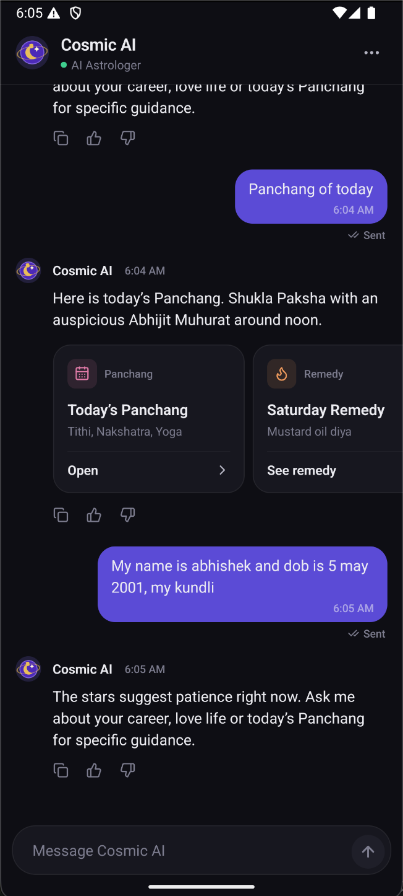

<p align="center">
  
</p>

<h1 align="center">Cosmic AI</h1>

<p align="center">
  An AI astrology chat app built with React Native. The AI astrologer answers your questions, and its replies can include recommendation cards (tarot, gemstones, remedies, consultations and more) that you can open from the chat.
</p>

<p align="center">
  
</p>

---

## Getting started

Requirements: Node ≥ 22.11 and a working [React Native environment](https://reactnative.dev/docs/set-up-your-environment).

```sh
npm install
cd ios && bundle install && bundle exec pod install && cd ..   # iOS only

npm start           # start Metro
npm run android     # or: npm run ios
npm test            # unit tests
```

> Native libraries such as `react-native-svg` mean the app must be **rebuilt** (`npm run android` / `npm run ios`) after `npm install`. Reloading Metro alone is not enough.

**Demo tips**
- Tap **⋯** in the header to reload the conversation as *Success*, *Empty* or *Network failure*.
- Send a message containing **"fail"** to see the failed-message and retry flow.

## Tech stack

| Concern | Choice |
| --- | --- |
| Framework | React Native 0.87 (CLI), TypeScript |
| Navigation | React Navigation 7, native stack |
| State | Zustand 5 |
| Animation | React Native Reanimated 4 |
| Icons | `lucide-react-native` + `react-native-svg` |
| Clipboard | `@react-native-clipboard/clipboard` |
| Tests | Jest |

## Key terms

| Term | Meaning |
| --- | --- |
| **Message** | One entry in the conversation. Its `sender` is `user`, `ai`, `human` (a real astrologer) or `system` (an event such as "session started"). |
| **Recommendation** | A suggested next step attached to an AI message, for example a gemstone or a tarot reading. It has a `type`, a `title`, and optional `subtitle`, `ctaLabel` and `payload` fields. |
| **Recommendation definition** | The app's description of one recommendation type: its label, icon, accent colour, button text, an optional custom card, and what happens when it's tapped. |
| **Registry** | A lookup table from a type string to the thing that renders it. Recommendations use one, and message senders use the same idea. |
| **Timeline item** | What the list actually renders: a message, a date separator or the typing indicator. These are derived from the messages. |
| **Grouping** | Messages from the same sender within 5 minutes are visually grouped: tighter spacing, shared avatar, joined bubble corners. |
| **Optimistic send** | Your message appears immediately as *sending*, then changes to *sent* or *failed* once the (mock) server responds. |
| **Normalised state** | Messages are stored as `ids[]` plus `byId{}`, so you can find and update one message without copying the whole list. |

## Project structure

```
App.tsx                         Root: SafeArea, navigator, DialogHost, ToastHost
assets/                         Logo (SVG source + PNG)
docs/                           README images
src/
├── screens/
│   └── ConversationScreen.tsx  Picks loading / error / empty / chat; owns the action sheet
├── components/
│   ├── chat/
│   │   ├── messages/           One component per sender + sender→component map
│   │   ├── MessageList.tsx     Inverted, virtualised FlatList
│   │   ├── MessageRow.tsx      Subscribes to a single message by id
│   │   ├── ChatBubble.tsx      Shared bubble: corners, reply quote, time, long-press
│   │   ├── ChatHeader.tsx      Logo, title, live status
│   │   ├── Composer.tsx        Input + send button + reply preview
│   │   ├── FeedbackBar.tsx     Copy / like / dislike + reason chips
│   │   ├── MessageActionSheet  Reply / Copy / Delete
│   │   └── …                   DateSeparator, TypingIndicator, DeliveryStatus, ReplyQuote
│   ├── dialog/                 showDialog() store + themed modal, toast
│   ├── states/                 Loading / Empty / Error built on one StateView
│   ├── brand/                  CosmicLogo
│   └── common/                 Button, IconButton, PressableScale, Avatar
├── features/
│   └── recommendations/        Pluggable recommendation framework
│       ├── types.ts            RecommendationDefinition contract
│       ├── registry.ts         register / look up definitions
│       ├── definitions.ts      All built-in types declared in one list
│       ├── RecommendationRenderer.tsx
│       ├── RecommendationCarousel.tsx
│       └── cards/              BaseRecommendationCard + specialised cards
├── store/conversationStore.ts  Zustand store: data + async actions
├── services/conversationApi.ts Mock API (latency, failures, scenarios)
├── data/mockConversation.ts    Payload from the brief + canned AI replies
├── types/conversation.ts       Domain + API types
├── utils/                      timeline builder, date formatting, ids
└── theme/                      Colours, spacing, radii, type scale, motion tokens
```

## Architecture

### Data flow

```
conversationApi (mock)  ──►  conversationStore (Zustand)  ──►  components
        ▲                         │  ids[] + byId{}
        └──── send / retry ◄──────┘  load · send · retry · delete · reply · feedback
```

1. `ConversationScreen` calls `load()` on mount. The store calls the API, normalises the response and sets `loadState` to `loading`, then `ready`, `error` or empty.
2. `MessageList` turns the messages into **timeline items** (dates, groups, typing indicator) and renders them in a `FlatList`.
3. Each `MessageRow` reads **only its own message** from the store and picks a component from the sender map.
4. User actions (send, delete, like and so on) call store actions. The store updates only the affected message, so only that row re-renders.

### Layers

| Layer | Responsibility | Knows about |
| --- | --- | --- |
| **services** | Talks to the backend (mocked). Can be swapped for HTTP or WebSocket. | API shapes only |
| **store** | Single source of truth and async flows (optimistic send, retry, AI reply). | services, domain types |
| **features** | Self-contained capabilities such as recommendations. | store/theme, never specific screens |
| **components** | Reusable UI. Rows are memoised and read from the store by id. | store, theme, features |
| **screens** | Compose components and choose which state to show. | everything above |

### Component design

- **Sender → component map** (`components/chat/messages/index.ts`). `user`, `ai`, `human` and `system` each have their own component. A new sender type means one new component and one new entry in the map.
- **Shared bubble chrome.** `ChatBubble` handles grouped corners, reply quotes, timestamps and long-press. Sender components only pick colours and extras.
- **AI replies are open text**, not bubbles, with a feedback toolbar and a recommendation carousel underneath.
- **Context for screen actions.** `MessageActionsContext` gives rows `openActions(id)` without passing it as a prop, which keeps `renderItem` stable and rows memoised.
- **App-wide dialogs.** `showDialog({...})` can be called from anywhere, including plain functions. `<DialogHost/>` at the root renders it, so the native `Alert` is never used.

### Recommendation framework

The chat never refers to specific recommendation types. Everything goes through a registry.

```ts
interface RecommendationDefinition {
  type: string;                      // matches recommendation.type from the API
  label: string;
  icon: LucideIcon;
  accent: string;
  defaultCta: string;
  Card?: ComponentType<RecommendationCardProps>;  // optional custom card
  onPress: (item: Recommendation) => void;        // navigate / sheet / dialog
}
```

- **`registry.ts`** maps a type string to its definition.
- **`definitions.ts`** declares every built-in type in one list.
- **`RecommendationRenderer`** looks up the definition, uses a **fallback** for unknown types, and renders `definition.Card ?? BaseRecommendationCard`.
- **Custom cards wrap the base card**, for example `ConsultationCard` adds an "online now" indicator and `PromotionCard` adds a "Limited time" badge.
- `Recommendation.type` is a plain `string` and `payload` is free-form. The backend can ship a new type before the app supports it, and it still shows as a generic card.

**Adding a new type takes one line:**

```ts
{ type: 'horoscope', label: 'Horoscope', icon: Sun, accent: '#F5A97F', defaultCta: 'Read today' },
```

### State management

- **Zustand** with a normalised `ids[]` + `byId{}` shape.
- `MessageRow` subscribes to `byId[id]`. A like, status change or chip selection re-renders **one row**.
- `MessageList` subscribes to a shallow-compared list of layout keys (id, sender, timestamp). It rebuilds the timeline only when grouping could change.
- `send` → `deliver` handles `sending → sent | failed`, then fetches the AI reply while `isAiTyping` is true. `retry` reuses `deliver`.
- UI-only state (dialog, toast) lives in small separate stores.

### Performance

- An **inverted `FlatList`** means the newest message is at offset 0, so there's no scroll on mount. `maintainVisibleContentPosition` keeps the viewport steady when messages are deleted or added.
- Module-level `renderItem` and `keyExtractor`, memoised rows, and tuned `windowSize` / batch sizes.
- Entrance animations only play for messages under 2 seconds old, so recycled rows never replay them.
- All motion runs on the UI thread through Reanimated, using shared timing tokens (`theme/motion.ts`, 150–320 ms, ease-out, no springs).

## Trade-offs

- **Mock backend only.** The store depends only on the `conversationApi` function signatures, so a real client can replace it.
- **Recommendation taps open a dialog.** Each definition's `onPress` is the hook for real navigation.
- **No pagination or persistence yet.** The inverted list and normalised store are ready for "load older messages".
- **Tests** cover the store and the timeline builder. There are no component or E2E tests.
